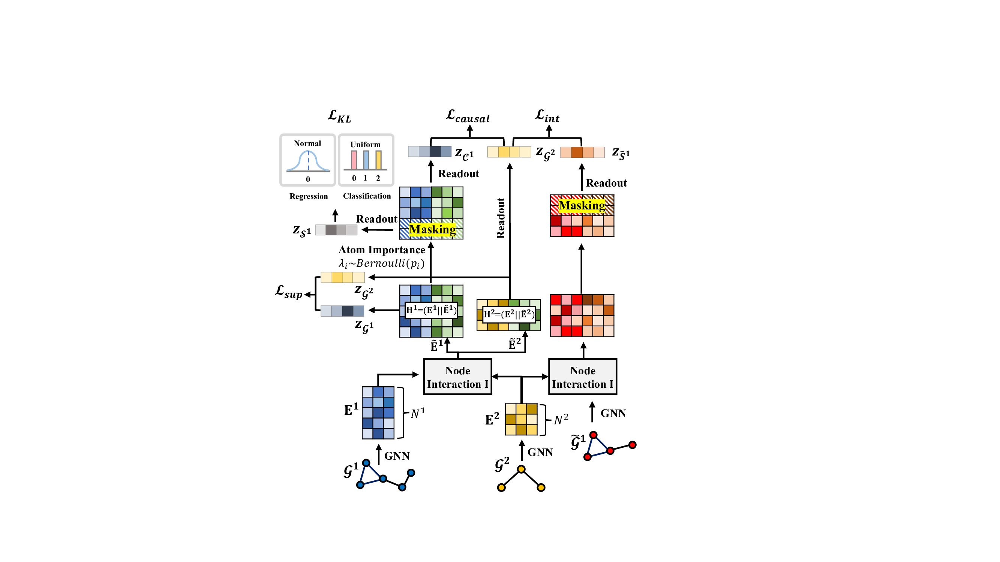

# Molecular Pair Scoring with Causal Substructure
The official source code for Molecular Pair Scoring with Causal Substructure (CAMPS).

## How to run the code
We provide `Readme.md` file for detailed instructions for running our code.

## Overview
Recently, molecular pair scoring, whose goal is to predict the interaction behavior between molecular pairs, got a surge of interest in molecular sciences due to its wide range of applications.
Despite the progress in molecular pair scoring tasks, existing methods overlook the nature of chemistry, i.e., a molecule contains the core substructure that determines the chemical properties of a molecule regardless of other atoms that exist in a molecule, facilitating a systematic prediction of chemical reactions and the behavior of chemical compounds.
In this work, we propose CAMPS that predicts the interaction behavior between a pair of molecules by detecting the core substructure that is causally related to chemical reactions.
To do so, we first assume a causal relationship based on the domain knowledge of molecular sciences and construct a structural causal model (SCM) that reveals the relationship between variables.
Based on the SCM, we introduce a novel conditional intervention framework whose intervention is conditioned on the paired molecule.
With the conditional intervention framework, our model successfully learns from the causal substructure and alleviates the confounding effect of shortcut substructures that are spuriously correlated to chemical reactions.
Moreover, we argue that CAMPS truly mimics the nature of chemical reactions, i.e., the causal substructure in a molecule varies depending on which other molecule it interacts with.
Extensive experiments on various tasks with real-world and synthetic datasets demonstrate the superiority of CAMPS over state-of-the-art baseline models.

## Overall model architecture
</img> 

## Requirements
- Python version: 3.7.10
- Pytorch version: 1.8.1
- torch-geometric version: 1.7.0